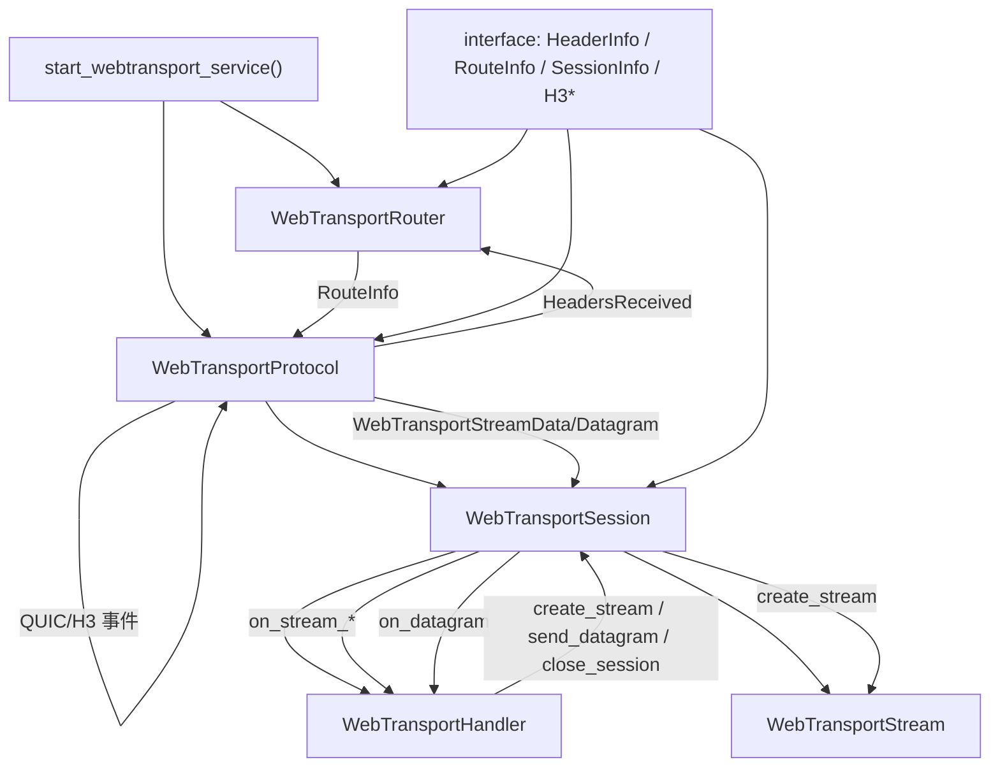

# WebTransport Connection 协作说明

本目录用于记录 `service/connection` 的核心抽象与协作关系，帮助理解模块之间的职责边界。

协作要点：
- `start_webtransport_service` 负责初始化服务、路由器与协议处理入口。
- `WebTransportProtocol` 处理 QUIC/H3 事件并创建 `WebTransportSession`。
- `WebTransportRouter` 根据路径找到 `RouteInfo`，用于实例化对应的处理器。
- `WebTransportSession` 绑定处理器并管理子流、数据报与会话生命周期。
- `WebTransportHandler` 只处理业务逻辑，通过上下文向会话发送数据或关闭连接。
