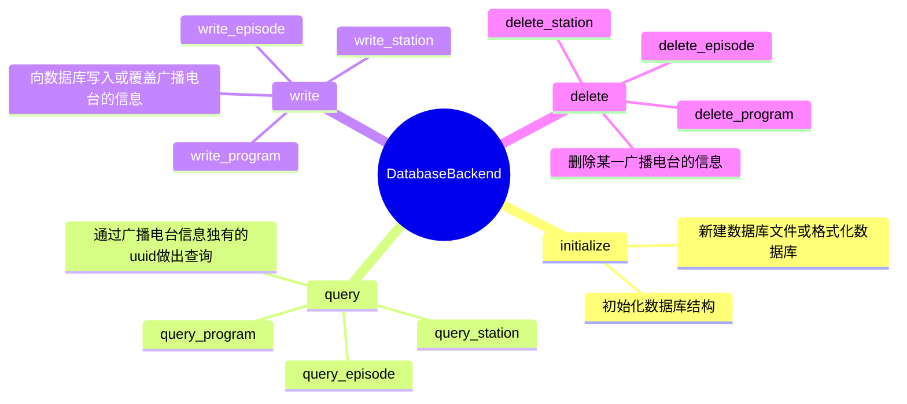

为插件开发暴露的数据库后端接口模板 `AbstractDatabaseBackend`


```mermaid
mindmap
    root((DatabaseBackend))
        initialize
            新建数据库文件或格式化数据库
            初始化数据库结构
        query
            通过广播电台信息独有的uuid做出查询
            query_episode
            query_program
            query_station
        write
            向数据库写入或覆盖广播电台的信息
            write_episode
            write_program
            write_station
        delete
            删除某一广播电台的信息
            delete_episode
            delete_program
            delete_station
```

---

数据库服务层

```mermaid
```